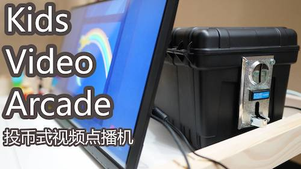

# Kids Video Arcade
* Teach kids self-control
* Limit screen time
* Parents control the video content, avoid kids clicking RANDOM videos from YouTube suggested videos
* A fun reward system at home, kids do something to recevie coins, for example, clean up toys and books, potty training, etc.

## **Demo video** 

https://www.youtube.com/watch?v=Y6r3-0KQ-Fw

The making of hardware part can also be viewed in the YouTube above.

## **Solution 1: Raspberry Pi + Coin Acceptor**

* Wiring

* Run the python script on RPI: `python kids_video_arcade_rpi.py`

* Issue: Full screen YouTube playback is choppy.

## **Solution 2: Arduino + PC + Coin Acceptor**

* Wiring

* Import `kids_video_arcade_arduino_board.ino` to the Arduino board

* Run the python script on pc: `python kids_video_arcade_arduino_python.py`

* You may need to grant permission for the USB port: `sudo chmod a+rw /dev/ttyACM0`

## **Web Interface**

* You can host it locally, the code is at https://github.com/seesunmoon/kids_video_arcade_web_ui

## **Work Flow**

1. Insert a coin
2. A list of videos shows up on the screen
3. Kids pick a video
4. The video plays in full screen (click is disabled during video playback)
5. When the video reaches to the end, the screen is redirected to a blank page (click and back are disabled)
6. Waiting for another coin

## **Parts**
* Coin Acceptor: https://ebay.to/2MMhJJs
* Raspberry Pi 3B+: https://ebay.to/2HWcuo1
* Arduino: https://ebay.to/2TpZkV3
* 10K resistor: https://ebay.to/2RxMDWo
* Tool box: http://bit.ly/2S2auml